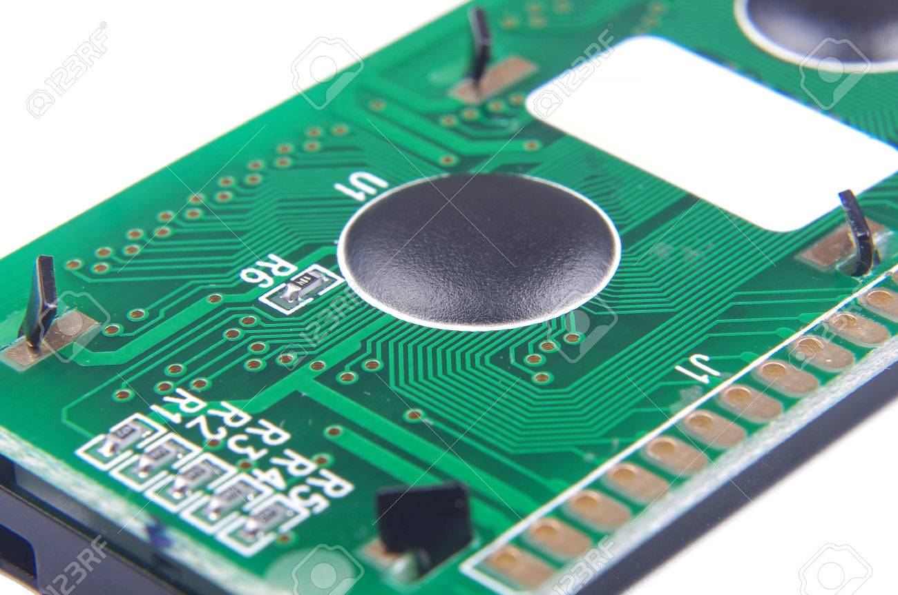
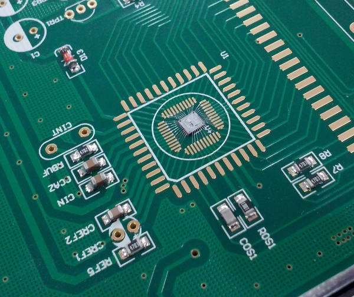

工行给的那个电子密钥没电了，今天拆开看了下，里边电路板上有坨黑色的东西，小时候玩的红白机卡带也常见到这黑色的东西。网上查了查，这也是芯片的一种封装方式，叫做 Chip-On-Board，业界好像也给它一个昵称“牛屎封装”。

#### Chip-On-Board （COB）

常见的芯片封装形式是把晶元放在金属、陶瓷或者塑料的壳体内，然后通过金线连接晶元和芯片管脚。

但 COB 的封装形式是直接把晶元粘在电路板上，然后在通过 wire bonding 把晶元和电路板的焊盘用金线连接起来，最后滴上环氧树脂进行保护。环氧树脂就是最后看到的那坨黑色的东西。

这种封装形式一般用在比较廉价的设备上，譬如小孩子的玩具上。当芯片发生损坏时，无法进行维修，只能把设备废弃。