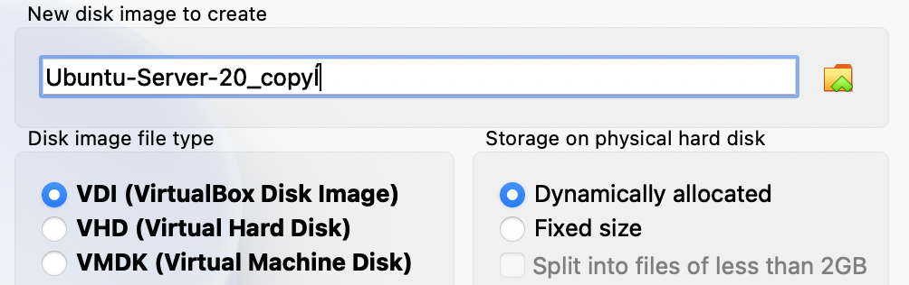

[VirtualBox](https://www.virtualbox.org) 是一款开源的虚拟机软件，Linux Windows Mac 三大平台均有对应的版本，现由 Oracle 进行开发。

对于个人用户来说，使用虚拟机的好处就是可以把虚拟机的开发环境跟个人日常使用的环境隔离开，即使虚拟机里的开发环境被整的乱七八糟也不会对宿主机有影响，是洁癖和强迫症患者的福音。不过使用虚拟机也有坏处，因其是对硬件的虚拟，所以性能比不上原生安装在物理硬件上的系统，因此如果不是特别的需要，建议虚拟机上不要安装带 gui 的系统，譬如可以安装 ubuntu server 进行相应的开发和测试。


#### 安装

如何安装 VirtualBox 并安装操作系统网上教程很多，这里只做一个概括。

0.  安装完 VirtualBox 主程序后，建议再安装[扩展包](https://download.virtualbox.org/virtualbox/6.1.22/Oracle_VM_VirtualBox_Extension_Pack-6.1.22.vbox-extpack)，以对 USB、磁盘加密等进行支持，当然不安装也不影响整体使用

1.  进入 VirtualBox 主界面后，通过 new 来搭建一套环境，这套环境可以理解为物理环境，就像我们去电脑城买的一台笔记本或者组装主机，new 的过程中会被要求指定 CPU 核心数、内存大小、占用硬盘空间大小等的资源配置。

2.  有了环境后，就需要下载系统 iso，然后放到 VirtualBox 环境的光驱上，这样 new 出来的环境在启动后，就会加载 iso 执行系统安装程序。需要注意，安装完成重启前，要把 iso 从光驱上删掉，防止重启后又进到了系统安装程序中。

3.  系统安装好后，除了虚拟机上系统的配置外，还可以再做一些文件共享的配置，譬如把宿主机的一些目录挂在到虚拟机系统的文件系统上，网上相关的帖子也有很多，这个贴一个 ubuntu server 的：[Mounting VirtualBox shared folders on Ubuntu Server 18.04 LTS (Bionic Beaver)](https://gist.github.com/estorgio/0c76e29c0439e683caca694f338d4003)。

    ```shell
    ## virtualbox 虚拟机实例的 Shared Folders 可以进行共享文件夹的配置
    # Devices -> Shared Folders
    
    ## virtualbox 在打开的虚拟机实例界面上操作插入 Guest Addition CD
    # Devices -> Insert Guest Addtions CD ...
    
    ## 挂载 Guest Addtions CD
    sudo mkdir /media/cdrom
    sudo mount -t iso9660 /dev/cdrom /media/cdrom
    
    ## 安装相关依赖
    sudo apt-get update
    sudo apt-get install -y build-essential linux-headers-`uname -r`
    
    ## 安装 Guest Addsions
    sudo /media/cdrom/./VBoxLinuxAdditions.run
    
    ## 添加当前用户到 vboxsf 用户组，添加好之后重启就可以访问宿主机的共享文件夹了
    sudo usermod -aG vboxsf $USER 
    ```

    

#### 扩容

如果安装的时候分配的硬盘空间比较少，用了一段时间后虚拟机上系统的磁盘空间不够了，就需要对虚拟机进行扩容。

VirtualBox 扩容也比较简单方便，在最开始新建虚拟机的时候，新建 VDI 时就有两个选项：Dynamic allocated 和 Fixed size，这两者的区别也清楚的写在界面上。Dynamic 模式是其占用的磁盘空间是虚拟机系统的实际大小，随着虚拟机上系统的大小而变化，最大不会超过分配的空间；而 Fixed 模式顾名思义就是，分配多少空间它就会真实占用多少宿主机的空间，这种模式的好处就是使用起来虚拟机上的系统会快一些。举个例子，譬如在 new 虚拟机的时候，我分配了 30G 的磁盘空间，而实际安装的操作系统只用了 8G，那么 Dynamic 占用的宿主机硬盘就是 8G，Fixed 占用的是 30G。

扩容的操作也与两种模式有关：

-   Dynamic，可以直接在 virtualbox 界面上进行扩容
-   Fixed，要先 copy 成 Dynamic，在 Dynamic 模式下扩容后，再 copy 成 Fixed，这时会有两个 Fixed vdi，配置虚拟机使用新生成的 vdi，删除旧的 vdi 就行了




以上的操作只是在虚拟机层面进行了磁盘扩容，相当于给主机加了块硬盘，操作系统对新加的硬盘是没法直接使用的，还需要对这块新加的硬盘进行分区上的处理，就 linux 来说分为两种情况：基于 LVM 和 非 LVM。

这是对两种情况分别讲如何扩容的一个帖子，具体我并没有尝试帖子里的办法是否切实可行：[Increase VirtualBox Disk Size](https://linuxhint.com/increase-virtualbox-disk-size/)，只是 mark 下以备不时。

